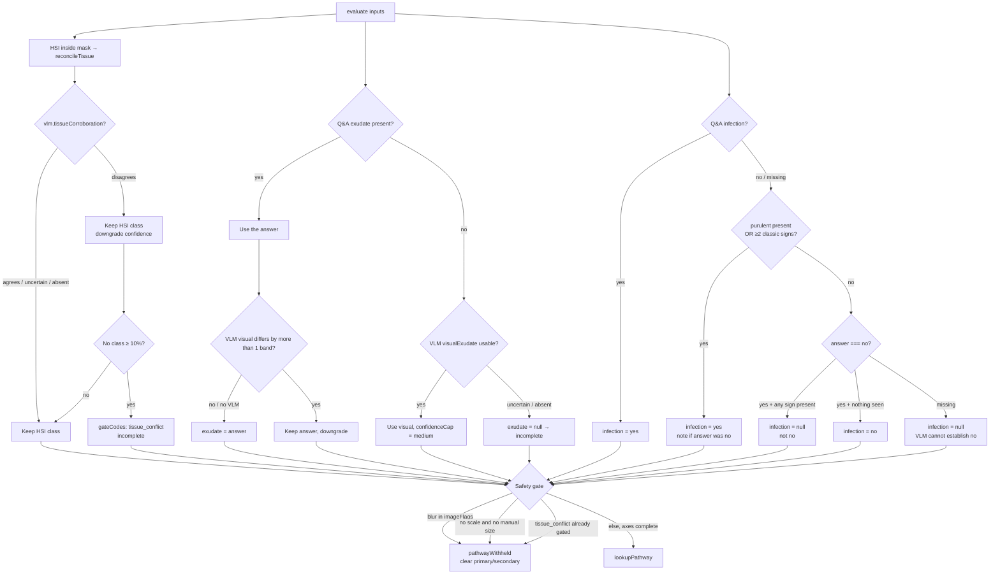

This is the product's core IP. One file: [`src/decision/engine.ts`](https://github.com/minesh16/woundcare-test/blob/main/src/decision/engine.ts). Types (erased at runtime) live in [`engine.types.ts`](https://github.com/minesh16/woundcare-test/blob/main/src/decision/engine.types.ts). Keep it free of runtime cross-file imports so `npm run test:rules` runs under `node --experimental-strip-types`.

:::tip[Diagrams]
The reconciliation flowchart below is pan/zoomable (toolbar, scroll, drag, fullscreen).
:::

<!-- docs-hook:auto:start:facts -->
| Constant | Value |
|---|---|
| `CWCS_RULES_VERSION` | `cwcs-2024.1+recon.1` |
| `TISSUE_PRESENCE_THRESHOLD` | `10` (% of wound bed) |
| Pathways | 26 (ids 1–26) |
| Offline engine tests | `npm run test:rules` — re-run; do not trust a stale count |
<!-- docs-hook:auto:end:facts -->

:::caution
The 26 dressing strings were transcribed from a PDF image (`CWCS Choice Guide_6524.pdf`). They still need a human check against the source before any graded or external use.
:::

## What `evaluate()` does

```
inputs
  → reconcileTissue (HSI + perfusion)
  → VLM tissueCorroboration (may cost confidence, never changes class)
  → reconcileExudate (Q&A authoritative)
  → reconcileInfection (conservative OR)
  → molnlyckeFlags (urgency-ordered referrals)
  → lookupPathway (tissue × exudate × infection)
  → confidence gates
  → safety gate (may clear the pathway)
  → EngineResult
```

`status` is `'complete'` only when there are no `incompleteReasons` **and** a pathway id remains. Urgent referrals do not delete the pathway; they prepend a "clinical review takes priority" note.

## CWCS lookup

`CWCS_PATHWAYS` is the government table. Key is `(tissue, exudate, infection)`:

| Tissue axis | Exudate | Infection | Pathway ids |
|---|---|---|---|
| `necrotic_ischaemic` | low / moderate / high | yes / no | 1–6 |
| `necrotic` (non-ischaemic) | low / moderate / high | yes / no | 7–12 |
| `slough` | low / moderate / high | yes / no | 13–18 |
| `granulating` | low / moderate / high | yes / no | 19–24 |
| `epithelialising` | **low only** | no / yes | 25 / 26 |

Epithelialising + moderate or high exudate is a deliberate hole in the source table: `lookupPathway` returns `null` and a note asks for reassessment. Pathway 26 carries an extra note to consider escalation for possible soft-tissue infection.

`getPathwayById(id)` exists for tests and the UI provenance line ("Australian Government wound care guide (pathway N)").

## Tissue precedence (HSI)

From the CWCS guide itself: if slough and granulation are both present, follow slough. Encoded as:

**necrotic > slough > granulating > epithelialising**

A class counts as present at `≥ TISSUE_PRESENCE_THRESHOLD` (10%). If nothing reaches 10%, the engine uses the largest class present and notes it. Empty bed → `tissueType: null` → incomplete.

Necrotic splits on perfusion (Mölnlycke step 3):

| `perfusion` | Result |
|---|---|
| `ischaemic` | `necrotic_ischaemic` |
| `non_ischaemic` | `necrotic` |
| `unknown` (default) | `necrotic`, plus a note to assess ABPI |

The questionnaire adapter in [`rules.ts`](https://github.com/minesh16/woundcare-test/blob/main/src/decision/rules.ts) maps `perfusion: 'reduced' → ischaemic`, `'normal' → non_ischaemic`, and ABPI bands onto numeric values so the vascular triggers fire (`lt_0_5` → 0.4, `gt_1_4` → 1.5).

## Reconciliation per axis

The cage in one sentence, from the source comment: *the VLM can lower our confidence, raise an infection suspicion, and fill an exudate gap — it can never change the tissue type, never overturn a clinician answer, and never clear a concern.*



### Tissue — HSI authoritative

`tissueCorroboration === 'disagrees'` does **not** change `axes.tissue`. It:

1. Sets `tissueConflict`,
2. Downgrades confidence one step,
3. If the measurement was already weak (no class ≥ threshold) → `gateCodes: 'tissue_conflict'` and incomplete.

### Exudate — Q&A authoritative

`reconcileExudate(answered, vlm)`:

| Situation | Result |
|---|---|
| Answer present, VLM within one band or absent | Answer, no downgrade |
| Answer present, VLM more than one band away | Answer, `downgrade: true` |
| Answer missing, VLM `none`/`low`/`moderate`/`high`/`very_high` | Mapped onto CWCS three-band (`none|low` → low, `high|very_high` → high), **`confidenceCap: 'medium'`** |
| Answer missing, VLM `uncertain` or no VLM | `null` → incomplete |

The VLM never overwrites an answer.

### Infection — conservative OR

`reconcileInfection(answered, vlm)`:

`yes` if any of:

- Q&A says yes, **or**
- `purulent === 'present'` (alone is enough), **or**
- two or more of `erythema`, `warmth`, `purulent`, `malodour` are `present`.

`no` **only** when Q&A says no **and** no VLM sign is `present` (classic or `friableGranulation`).

Anything else is `null` (incomplete), including:

- Q&A "no" plus a single visible sign → null, not no.
- VLM reporting every sign `absent` with no Q&A → null. **The VLM can never establish `no`.**

One classic sign alone, without purulence and without a "yes" answer, is not enough.

## Safety gate

Deliberate behaviour change from Phase 0. Phase 0 still emitted a pathway at `low` confidence. Phase 2 **withholds** it when any of these fire, even if the three axes resolved:

| `gateCodes` value | Condition | UI copy key in `src/copy/plainLanguage.ts` |
|---|---|---|
| `blurred_image` | VLM `imageFlags` includes `blur` | retake, hold steady |
| `no_scale` | `markerFound === false` and `manualSizeProvided` is not true | coin in frame, or enter size |
| `tissue_conflict` | VLM disagrees **and** no HSI class reached threshold | retake in even light |

When `pathwayWithheld`:

- `cwcsPathwayId` is set back to `null`
- `primary` and `secondary` are emptied
- `status` is `'incomplete'`
- a note records that a dressing suggestion was withheld because the assessment is not reliable enough to act on

Related, **not** withholding:

- `low_light` → downgrade only.
- No marker but `manualSizeProvided` → keep pathway, note that hand-entered size was used.
- No marker and no manual size → `no_scale` gate (withhold) **and** confidence downgrade.

`pathwayWithheld === true` is distinct from "we couldn't decide": the axes may have resolved; the audit trail records that the engine decided not to say.

## Mölnlycke flags

`molnlyckeFlags(inputs, tissueType)` — overlay, not a second dressing engine. Sorted urgent → mdt → review.

| Code | Trigger | Urgency |
|---|---|---|
| `probe_to_bone` | `probeToBone` | urgent |
| `systemic_infection` | `systemicInfection` | urgent |
| `spreading_infection` | `spreadingErythemaOver2cm` | urgent |
| `critical_ischaemia` | `abpi < 0.5` | urgent |
| `incompressible_arteries` | `abpi > 1.4` | review (measure TBPI) |
| `diabetes_tbpi` | diabetes and no ABPI number | review |
| `necrotic_tissue` | tissue is necrotic / necrotic_ischaemic | mdt (debridement) |
| `hard_to_heal` | DFU or `<40% healing in 4 weeks` questionnaire flag | mdt |
| `lops` | loss of protective sensation | mdt |

The `<40% in 4 weeks` trigger today is a **questionnaire boolean** (`hardToHeal`). Computing it from `wound_timeline` history is [roadmap](/docs/roadmap/).

Periwound maceration adds a note about protecting surrounding skin; periwound redness **never fires** `spreading_infection` alone — the >2 cm judgement stays with the assessor.

## Confidence

Start from `cvConfidence` (default `'medium'`). Each of these downgrades one step (`high → medium → low`):

- no marker and no manual size
- no class reached threshold
- tissue VLM disagreement
- exudate band disagreement
- `low_light`

VLM-filled exudate caps at `'medium'` even if nothing else fired. Blur forces `'low'`.

## Adapter: demo session → engine inputs

[`toEngineInputs()`](https://github.com/minesh16/woundcare-test/blob/main/src/decision/rules.ts) maps the Zustand `ScanSession` onto `EngineInputs` so the existing result screen is already on the CWCS engine. `assess()` still computes a demo urgency / classification for the headline, then **overlays** engine referrals (an urgent flag raises urgency to `immediate`) and replaces the dressing string with the pathway when one exists.

V2 evaluate / run pass `EngineInputs` directly, including `vlm` and `periwound`.

<!-- docs-hook: last auto-checked against commit 72b0cc6 on 2026-09-23 -->
