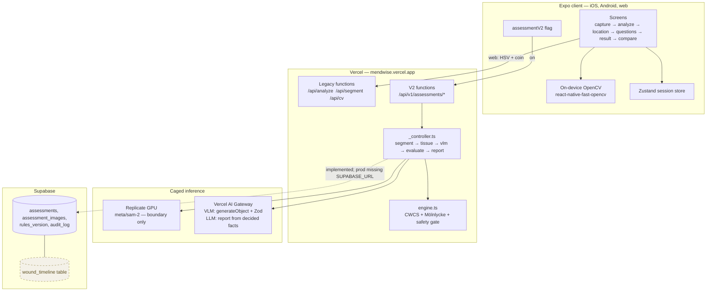
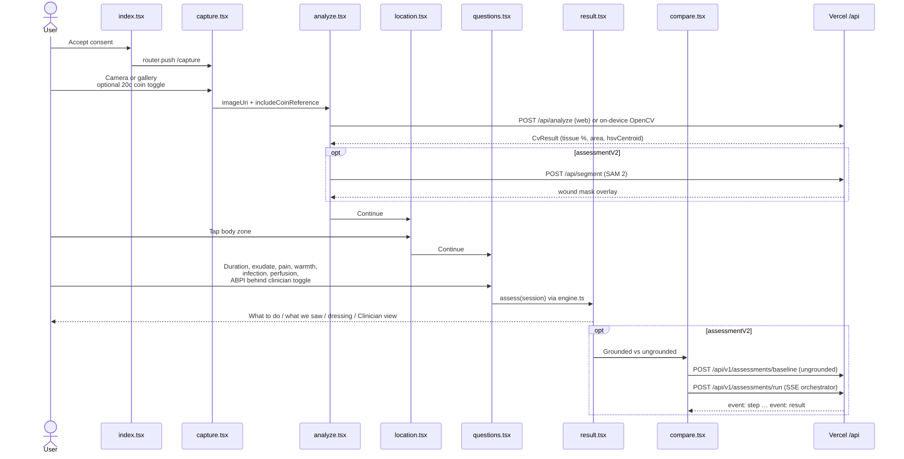

This page is the product's actual moat. The rest of the stack exists to feed a deterministic engine and to narrate what that engine already decided.

:::tip[Diagrams]
Architecture diagrams are pan/zoomable. Use the toolbar, scroll to zoom, drag to pan, or open fullscreen. Double-click fits the view.
:::

## The cage

Five non-negotiable invariants. They are also in [`.cursor/rules/mendwise.mdc`](https://github.com/minesh16/woundcare-test/blob/main/.cursor/rules/mendwise.mdc) and [`docs/HANDOFF.md`](https://github.com/minesh16/woundcare-test/blob/main/docs/HANDOFF.md).

1. **Determinism is authoritative.** The CWCS 26-pathway table and Mölnlycke referral triggers in [`src/decision/engine.ts`](https://github.com/minesh16/woundcare-test/blob/main/src/decision/engine.ts) make the dressing / referral decision. AI only produces *inputs* and narrates *outputs* — it never emits a pathway.
2. **AI is caged.** SAM 2 = boundary only. OpenCV HSI = tissue % only. Frontier VLM = strict-JSON enums only (`generateObject` + Zod, `temperature: 0`, no free-text field). Frontier LLM = report generation from already-decided facts only.
3. **Additive, never destructive.** New work sits behind the `assessmentV2` flag ([`src/config/featureFlags.ts`](https://github.com/minesh16/woundcare-test/blob/main/src/config/featureFlags.ts), `EXPO_PUBLIC_ASSESSMENT_V2`) and `/api/v1/assessments/*`. The original HSV flow remains as capture quality-gate, offline fallback, and SAM prompt-seed (centroid used to *select* a mask, not to prompt the model — `meta/sam-2` has no point/box input).
4. **Conservative by default.** No marker / low confidence / conflicting signals → "incomplete, retake or escalate". Never a confident dressing call at low confidence. The safety gate **withholds** the pathway (`pathwayWithheld`, `gateCodes`) rather than stating one weakly.
5. **No model fine-tuning.** Zero-shot SAM 2 and frontier VLM / LLM only.

`src/decision/engine.ts` stays a single self-contained runtime file (`import type` only from `engine.types.ts`) so `npm run test:rules` runs under `node --experimental-strip-types` with no build step.

## System architecture

What is live vs dashed: **Supabase writes are implemented** in [`api/v1/assessments/_store.ts`](https://github.com/minesh16/woundcare-test/blob/main/api/v1/assessments/_store.ts) and degrade to stdout when unset. On production (verified 21 Sep 2026 against [`GET /api/v1/assessments/health`](https://mendwise.vercel.app/api/v1/assessments/health)) `store` is `false` because `SUPABASE_URL` is missing. The `wound_timeline` **table** exists; the **UI and the "<40% area reduction in 4 weeks" trigger from real history** do not — those are [roadmap](/docs/roadmap/).

Native OpenCV runs on-device in the custom dev client. Web never runs OpenCV in the browser: [`src/cv/opencvPipeline.ts`](https://github.com/minesh16/woundcare-test/blob/main/src/cv/opencvPipeline.ts) POSTs to `/api/analyze`, which uses `opencv-js-wasm`. If that function is unreachable (plain `expo start --web`), the client falls back to a deterministic demo pipeline.

## User-facing sequence

Actual screen order in [`src/app/`](https://github.com/minesh16/woundcare-test/tree/main/src/app) — capture → analyze → **location → questions** → result. (A "compare" screen is appended when `assessmentV2` is on.)

The SSE orchestrator is **shipped**, not roadmap. [`api/v1/assessments/run.ts`](https://github.com/minesh16/woundcare-test/blob/main/api/v1/assessments/run.ts) streams `event: step` then `event: result`. [`src/assessment/client.ts`](https://github.com/minesh16/woundcare-test/blob/main/src/assessment/client.ts) `runAssessmentStream()` consumes it. The comparison screen is the client that currently drives a full V2 run.

## Where the decision happens

| Step | Who | What it is allowed to do |
|---|---|---|
| Capture quality + HSV centroid | OpenCV (native or `/api/analyze`) | Blur / exposure / coin; seed for mask selection |
| Boundary | SAM 2 on Replicate | A mask. Nothing clinical |
| Tissue % + periwound | HSI inside the mask (`tissue.ts`, `_tissueOps.ts`) | Percentages and a 4 cm ring, or `periwound: null` if no scale |
| Visual signs | Caged VLM (`vlm-features.ts`) | Enums in `vlm.schema.ts`. `uncertain` always legal |
| Q&A | `questions.tsx` | Exudate, infection, perfusion, ABPI band, … |
| Decision | `evaluate()` in `engine.ts` | Pathway, referrals, gates. No AI |
| Report | Template first, LLM optional | Narrate the `EngineResult`. Cage check, else template |
| Persist | `_store.ts` | Optional. Never on the critical path |

The [pipeline page](/docs/architecture/pipeline/) walks that list as a data-flow diagram. The [decision engine page](/docs/architecture/decision-engine/) is the reconciliation and safety-gate deep-dive.

## Two pipelines on purpose

The original demo flow (`capture → analyze → location → questions → result`) still compiles and runs with the flag off. `assess()` in [`src/decision/rules.ts`](https://github.com/minesh16/woundcare-test/blob/main/src/decision/rules.ts) already calls `evaluate()`, so even the "legacy" result screen is backed by the CWCS engine.

The V2 namespace adds server-side SAM 2, mask-restricted tissue, VLM, report LLM, SSE, persistence, and the comparison arm. Callers in [`src/assessment/client.ts`](https://github.com/minesh16/woundcare-test/blob/main/src/assessment/client.ts) return `null` when the flag is off or the network fails, so a missing server never breaks the demo.

<!-- docs-hook: last auto-checked against commit 72b0cc6 on 2026-09-23 -->
