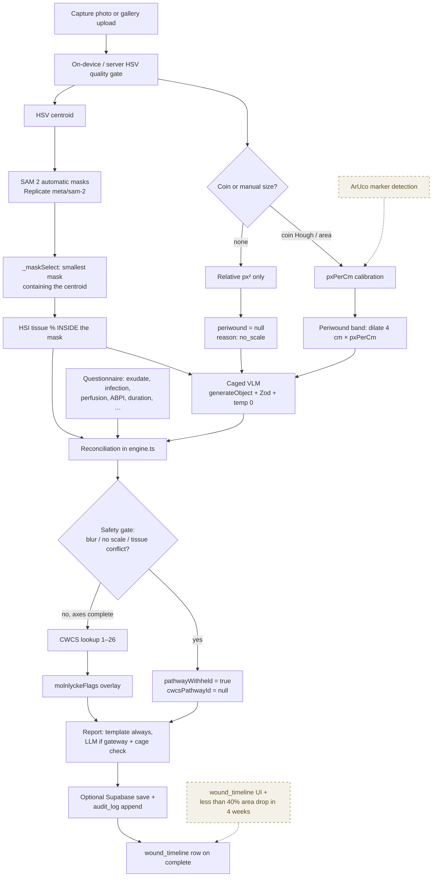

<!-- docs-hook:auto:start:status -->
**Pipeline status (from source, not the Phase 2 plan):** every box with a solid border below is implemented. Dashed boxes are schema-ready or helper-ready but not yet a product surface.
<!-- docs-hook:auto:end:status -->

`PHASE2_PLAN.md` labelled the SSE orchestrator as Phase 3. It shipped in Phase 2: [`api/v1/assessments/run.ts`](https://github.com/minesh16/woundcare-test/blob/main/api/v1/assessments/run.ts) + [`_controller.ts`](https://github.com/minesh16/woundcare-test/blob/main/api/v1/assessments/_controller.ts). Trust this page and `HANDOFF.md` over the plan doc for "is it built?".

:::tip[Diagrams]
The data-flow chart is pan/zoomable. Use the toolbar, scroll to zoom, drag to pan, or open fullscreen.
:::

## Data flow

## Step by step (as implemented)

### 1. Capture

[`src/app/capture.tsx`](https://github.com/minesh16/woundcare-test/blob/main/src/app/capture.tsx) — `expo-camera` or `expo-image-picker`. Optional "include 20c coin" toggle stored on the Zustand session. Web capture uses `getUserMedia` (HTTPS required) and a data-URI; native uses a file URI.

### 2. HSV analysis (legacy path, still the quality gate)

[`src/cv/opencvPipeline.ts`](https://github.com/minesh16/woundcare-test/blob/main/src/cv/opencvPipeline.ts):

- **Native:** [`opencvNative.native.ts`](https://github.com/minesh16/woundcare-test/blob/main/src/cv/opencvNative.native.ts) via `react-native-fast-opencv` (custom dev client; Expo Go is not supported).
- **Web:** POST [`api/analyze.ts`](https://github.com/minesh16/woundcare-test/blob/main/api/analyze.ts) (`opencv-js-wasm`).
- **Fallback:** deterministic pseudo-breakdown so the demo never hard-crashes.

This pass now **forwards the wound mask** into `breakdownFromBuffer` (Phase 2 bugfix: tissue used to be counted over the whole frame). It also emits `hsvCentroid` for mask selection.

Coin scale is Hough-circle based ([`measureArea.ts`](https://github.com/minesh16/woundcare-test/blob/main/src/cv/measureArea.ts), Australian 20c diameter 28.52 mm). `pxPerCmFromMarkerSide()` is ready for ArUco; **detection is not wired** (dashed on the diagram).

### 3. SAM 2 boundary

Behind `assessmentV2`. Client: [`src/cv/segment.ts`](https://github.com/minesh16/woundcare-test/blob/main/src/cv/segment.ts) → [`api/segment.ts`](https://github.com/minesh16/woundcare-test/blob/main/api/segment.ts) → [`api/_sam2.ts`](https://github.com/minesh16/woundcare-test/blob/main/api/_sam2.ts).

`meta/sam-2` is the **automatic** mask generator. There is no point/box prompt on the Replicate schema, so the HSV centroid is applied after the fact in [`api/_maskSelect.ts`](https://github.com/minesh16/woundcare-test/blob/main/api/_maskSelect.ts): among masks that contain the centroid, pick the smallest. Unconfigured or failed SAM 2 → HSV mask, confidence downgraded.

The orchestrator repeats this inside `_controller.ts` rather than HTTP-self-fetching.

### 4. Mask-restricted tissue + periwound

[`api/v1/assessments/tissue.ts`](https://github.com/minesh16/woundcare-test/blob/main/api/v1/assessments/tissue.ts) + [`api/_tissueOps.ts`](https://github.com/minesh16/woundcare-test/blob/main/api/_tissueOps.ts).

- Pixels outside the mask are **skipped**, not binned as `other`.
- No SAM mask → HSV combined mask and `maskSource: 'hsv'`.
- Periwound: dilate by `PERIWOUND_BAND_CM = 4` × `pxPerCm`, subtract the wound, classify redness / maceration (`MACERATION_THRESHOLD_PCT = 15`). No scale → `null`, not a guess.

### 5. Caged VLM

[`api/v1/assessments/vlm-features.ts`](https://github.com/minesh16/woundcare-test/blob/main/api/v1/assessments/vlm-features.ts) through [`_gateway.ts`](https://github.com/minesh16/woundcare-test/blob/main/api/v1/assessments/_gateway.ts). Schema: [`src/decision/vlm.schema.ts`](https://github.com/minesh16/woundcare-test/blob/main/src/decision/vlm.schema.ts).

Every field is an enum (`uncertain` always allowed). Unavailable is a normal outcome: the engine runs without the VLM axis.

Gateway notes that affect operations:

- Model ids from `getAvailableModels()`, preference lists, env overrides `MENDWISE_VLM_MODEL` / `MENDWISE_LLM_MODEL`.
- 45 s timeout (a reasoning vision pass measured ~28 s; 20 s was aborting successful work).
- `temperature: 0` is **silently ignored by reasoning models** (GPT-5 family). The cage is the Zod schema; reproducibility is why the model id is audited.
- Free-tier account: Anthropic + `gemini-2.5-pro` restricted; `gemini-2.5-flash`, `gpt-5`, `gpt-5-mini` work. Preference lists put free-tier models at the tail so better models activate when credits exist — no code change.

### 6. Evaluate

[`api/v1/assessments/evaluate.ts`](https://github.com/minesh16/woundcare-test/blob/main/api/v1/assessments/evaluate.ts) calls `evaluate()` in `engine.ts`. No AI. One audit write point. See [Decision engine](/docs/architecture/decision-engine/).

### 7. Report

[`api/v1/assessments/report.ts`](https://github.com/minesh16/woundcare-test/blob/main/api/v1/assessments/report.ts):

1. Always render [`src/assessment/reportTemplate.ts`](https://github.com/minesh16/woundcare-test/blob/main/src/assessment/reportTemplate.ts) (clinician + patient documents).
2. Optionally `generateObject` with a two-string schema, prompt from [`reportPrompt.ts`](https://github.com/minesh16/woundcare-test/blob/main/src/assessment/reportPrompt.ts), facts **whitelisted** (no image, no raw Q&A, no identifiers).
3. [`reportCage.ts`](https://github.com/minesh16/woundcare-test/blob/main/src/decision/reportCage.ts) rejects a narration that names the wrong pathway or invents a dressing. Failure → template.

### 8. Persist + audit

[`_store.ts`](https://github.com/minesh16/woundcare-test/blob/main/api/v1/assessments/_store.ts): `saveAssessment`, `writeAudit`, `appendTimeline` if `result.status === 'complete'`. Missing env → no-op + stdout. Production currently takes this branch. Schema: [Supabase module](/docs/modules/supabase/).

## Orchestrator degradation policy

From `_controller.ts` — a state machine, not an agent:

| Step | If it fails |
|---|---|
| SAM 2 | HSV mask, step `degraded` |
| VLM | Engine runs without `vlm`, step `degraded` |
| Report LLM | Template, step `degraded` |
| Supabase | Result still returned, audit to stdout |
| **Evaluate** | The only non-optional step — the stream emits `event: error` |

`maxDuration` for `run.ts` is **300 s in `vercel.json`**, not an `export const config` in the handler.
